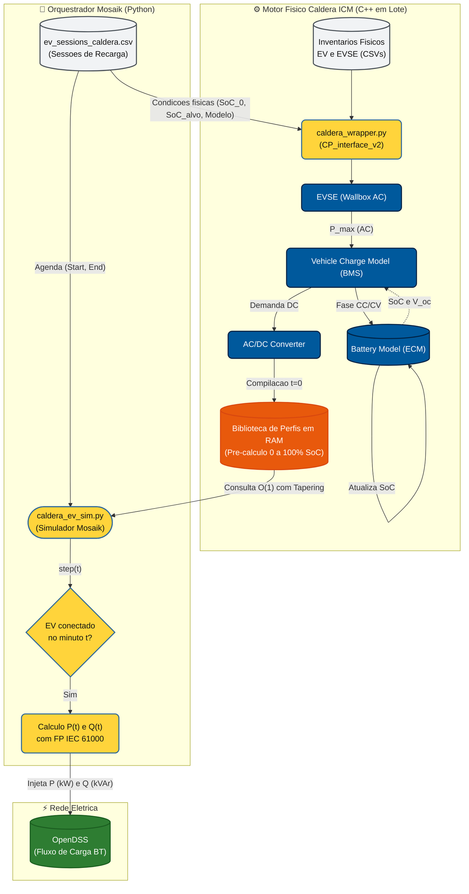

# Diário de Implementação: Caldera ICM

Este documento serve como um registro vivo do progresso de implementação da metodologia física de recarga de EVs (Caldera ICM). Ele será atualizado gradativamente conforme avançamos pelas 4 fases propostas no documento conceitual (`proposta_caldera_icm.md`).

---

## 🟢 Fase 1: Compilação e Configuração do Motor C++ (Concluída)

**Objetivo:** Trazer o motor físico do laboratório de Idaho (escrito em C++) para dentro do ecossistema do projeto gerenciado pelo `uv` (Python 3.12).

### Desafios Técnicos Superados:
1. **Ausência de empacotamento padrão:** O repositório oficial do Caldera ICM não utiliza os padrões modernos do Python (`pyproject.toml` ou `setup.py`), inviabilizando a instalação direta via `uv add git+...`. Foi necessário realizar a compilação "nua" via CMake.
2. **Conflito de Versões do Python:** O CMake, ao rodar em nível de sistema, tentou linkar as bibliotecas usando a versão global do Ubuntu (Python 3.14). Como extensões `.so` são estritamente atreladas à versão do compilador, o Python 3.12 do ambiente virtual recusou a importação.
3. **Resolução:** Instalação global dos cabeçalhos do `pybind11` e injeção forçada do caminho do executável Python do ambiente virtual para dentro do CMake.

### Passos Reproduzíveis da Execução:
Para compilar novamente o projeto do zero (ex: em uma nova máquina ou conteinerização final), o fluxo executado foi:

```bash
# 1. Instalação das dependências e headers no sistema (WSL/Ubuntu)
sudo apt-get update
sudo apt-get install -y pybind11-dev python3-dev build-essential cmake git

# 2. Clonagem do repositório em diretório externo ao projeto
cd /mnt/c/Users/pvict/OneDrive/TCC/
git clone https://github.com/idaholab/Caldera_ICM.git
cd Caldera_ICM
mkdir build && cd build

# 3. Compilação forçada apontando para o Python 3.12 do 'uv'
cmake -DPYTHON_EXECUTABLE=/mnt/c/Users/pvict/OneDrive/TCC/ev-analysis-2026/.venv/bin/python ..
make -j4

# 4. Transplante dos arquivos compilados (.so) para o ambiente de simuladores
find . -name "*.so" -exec cp {} /mnt/c/Users/pvict/OneDrive/TCC/ev-analysis-2026/src/simulators/ev/ \;
```

**Resultado:** Sucesso. O script de teste no Python (`import Caldera_ICM`) retornou sem erros, comprovando a integração nativa dos modelos físicos da bateria.

### Fundamentação Tecnológica: Integração C++ e Python (`pybind11`)
Para fins de registro e defesa acadêmica, é importante documentar como ocorre a interoperabilidade entre as linguagens neste projeto:
* **A Necessidade do C++:** Simular a eletroquímica (tensão, corrente, aquecimento e *tapering*) de milhares de veículos elétricos a cada passo de tempo é computacionalmente exaustivo. O motor Caldera ICM foi escrito em C++ para garantir a velocidade e o acesso direto à memória (alta performance), inviáveis em Python puro.
* **A Ponte (`pybind11`):** Para aliar a velocidade do C++ com a facilidade de orquestração do Python (Mosaik), os engenheiros de Idaho utilizaram a biblioteca `pybind11`. Ela atua como um "tradutor simultâneo".
* **O Arquivo Binário (`.so`):** O processo de compilação (CMake/Make) derrete o código C++ bruto e os mapeamentos do `pybind11` em um bloco de código de máquina chamado *Shared Object* (arquivo `.so`, o equivalente a uma `.dll` no Windows). 
* **Em Tempo de Execução:** Ao executar `import Caldera_ICM` no Mosaik, o interpretador Python não procura um arquivo `.py`. Ele carrega o arquivo `.so` compilado. O Python aciona as funções como se fossem nativas, mas o `pybind11` intercepta os parâmetros, entrega para o processamento ultrarrápido do C++, e devolve o resultado final para o Python.

---

## 🟡 Fase 2: Refatoração do Pipeline de Dados (Concluída)

**Objetivo Atual:** Substituir a geração determinística de "blocos quadrados de potência" do antigo script por um **Gerador de Eventos Físicos** baseado no dataset norueguês.

**Lógica a ser implementada (`pipeline_ev.py`):**
1. O pipeline varrerá os dados identificando sessões de recarga por residência.
2. Calculará o **Tempo Ocioso ($t_{idle}$)** para classificar se o carro encheu a bateria ou não.
3. Utilizará a engenharia reversa (Equação 3 de El-Hendawi et al., 2022) para definir o SoC Inicial das sessões completas.
4. Implementará a **Retro-propagação Temporal** para "micro-sessões" com $\Delta t \le 30$ min, garantindo que o SoC Inicial da segunda sessão seja amarrado matematicamente ao SoC Final da primeira.
5. Exportará uma "Tabela de Sessões" (contendo `Hora Início`, `Hora Fim`, e `SoC Inicial`) para ser consumida pelo Mosaik.

---


## Anexo: Parametrização da Frota Brasileira (Capacidade de Baterias)
Para garantir a aderência da simulação à realidade da rede de Baixa Tensão brasileira, a capacidade das baterias virtuais será distribuída com base nos **10 veículos eletrificados plug-in mais vendidos no Brasil entre janeiro de 2022 e agosto de 2026**. 
A inclusão conjunta de modelos 100% elétricos (BEV) e híbridos plug-in (PHEV) é fundamental, pois ambos são equipados com carregadores de bordo e conectam-se à rede elétrica (grid) para realizar a recarga de seus bancos de baterias, impactando diretamente o fluxo de carga do cenário simulado.

**Relatório Técnico: Capacidade de Bateria - Top 10 Veículos Eletrificados plug-in mais vendidos (Jan/2022 a Ago/2026)**

| Ranking | Modelo | Fabricante | Capacidade da Bateria | Tipo | Qtd. Vendida | Fonte Técnica / Link |
| :---: | :--- | :--- | :--- | :--- | :--- | :--- |
| 1 | BYD DOLPHIN MINI GS5EV | BYD | 38,88 kWh | BEV | 80820 | Ficha técnica BYD |
| 2 | BYD DOLPHIN GS 180EV | BYD | 44,9 kWh | BEV | 58259 | Ficha técnica BYD |
| 3 | BYD SONG PLUS GS DM | BYD | 18,3 kWh | PHEV | 57821 | Ficha técnica BYD |
| 4 | BYD SONG PRO GS DM | BYD | 18,3 kWh | PHEV | 40565 | Ficha técnica BYD |
| 5 | BYD KING GS DM | BYD | 18,3 kWh | PHEV | 22091 | Ficha técnica BYD |
| 6 | GEELY EX2 MAX | GEELY | 39,4 kWh | BEV | 17966 | Ficha técnica GEELY |
| 7 | GWM HAVAL H6 PHEV 19 | GWM | 19,0 kWh | PHEV | 16980 | Ficha técnica GWM |
| 8 | BYD SONG PRO GL DM | BYD | 12,96 kWh | PHEV | 15848 | Ficha técnica BYD |
| 9 | BYD DOLPHIN MINI GS EV | BYD | 38,88 kWh | BEV | 15827 | Ficha técnica BYD |
| 10 | GWM HAVAL H6 GT | GWM | 35,00 kWh | PHEV | 14576 | Ficha técnica GWM |

### Lógica de Atribuição de Frota (Monte Carlo e Restrição Física)
Para alocar os veículos da tabela acima aos perfis virtuais do dataset, o algoritmo utiliza uma dupla camada matemática de seleção:

1. **Filtro Físico de Viabilidade:**
   A energia consumida em uma única sessão ($E_{sessao}$) não pode violar a capacidade máxima da bateria ($C_{bateria}$). O algoritmo identifica a sessão mais extrema da semana ($E_{max}$) e descarta todos os veículos comerciais cuja bateria seja menor que $E_{max}$.
   *Matematicamente:* $C_{bateria} \ge E_{max}$

2. **Distribuição de Probabilidade de Mercado (Roleta Viciada):**
   Dentre os veículos que sobrevivem ao filtro físico, a alocação não é aleatória uniforme. Aplica-se um sorteio ponderado (Distribuição de Probabilidade Discreta) baseado no volume de vendas (Market Share). 
   Sendo $V_i$ as vendas do veículo $i$, o total de vendas do grupo filtrado é $S_{total} = \sum V_i$. A probabilidade de um carro ser atribuído a uma residência é dada por $P_i = \frac{V_i}{S_{total}}$.

## 🟢 Fase 3: Criação do Wrapper do Simulador Mosaik (Concluída)

### Arquitetura de Co-simulação e Fluxo de Dados Físico

O diagrama abaixo ilustra o fluxo completo de dados e a divisão entre a **Fase de Inicialização / Pré-cálculo em Lote (C++ Batch)** e a **Fase de Execução Temporal Co-simulada (Mosaik & OpenDSS Runtime)**:



---

### Funcionamento Interno dos Módulos do Caldera ICM (C++)

O núcleo eletroquímico do Caldera ICM resolve as equações fundamentais de transferência de potência por meio de 4 módulos acoplados:

1. **`EVSE` (Equipamento de Alimentação do VE / Wallbox):**
   - Atua como a fronteira entre a rede de distribuição e o veículo.
   - Estabelece as restrições nominais de contorno: tensão da rede (220V), corrente nominal máxima (32A para Wallboxes L2) e potência máxima AC permitida ($P_{\text{max, AC}} = V \cdot I$).
   - Repassa o teto de potência disponível para o inversor de bordo do carro.

2. **`Vehicle Charge Model` (BMS - *Battery Management System*):**
   - É o cérebro que comanda a estratégia de recarga em duas fases:
     - **Modo CC (*Constant Current*):** Enquanto o SoC está baixo, comanda a máxima corrente que a bateria e o EVSE suportam simultaneamente.
     - **Modo CV (*Constant Voltage* / *Tapering*):** Ao se aproximar de 100% de SoC (tensão de circuito aberto próxima da tensão máxima de saturação da célula), reduz progressivamente a corrente de entrada para proteger o ânodo/cátodo contra sobreaquecimento e degradação prematura.
   - Consulta a voltagem interna instantânea do modelo da bateria e emite uma requisição de potência em corrente contínua ($P_{\text{DC}}$).

3. **`Battery Model` (Eletroquímica e Circuito Equivalente):**
   - Modela a célula de íons de lítio por meio de um Circuito Equivalente (*Equivalent Circuit Model* - ECM), composto por uma fonte de tensão em circuito aberto dependente do SoC ($V_{OC}(SoC)$) em série com resistências internas ($R_{int}$) e pares RC que capturam a dinâmica de relaxação.
   - Integra a corrente recebida ao longo do tempo para computar a variação incremental do Estado de Carga ($\Delta SoC = \frac{\int I \, dt}{C_{Ah}}$) e retroalimenta o BMS.

4. **`AC/DC Converter` (Retificador de Bordo / Inversor):**
   - Modela o estágio de eletrônica de potência que converte a energia alternada da rede (AC) em corrente contínua (DC) para a bateria.
   - Aplica a curva de perdas e rendimento de conversão ($\eta \approx 92\%$), determinando a potência ativa real que o veículo exige dos condutores da concessionária:
     $$P_{\text{AC}} = \frac{P_{\text{DC}}}{\eta}$$
   - Fornece o perfil físico consolidado para a interface de co-simulação.

---

### A Estratégia de Resolução em Lote (*Batch Pre-calculation*)

Um dos grandes diferenciais arquiteturais implementados neste projeto reside na **estratégia de pré-resolução de curvas em lote (*Batch Compilation*)**:

#### O Desafio da Simulação em Tempo Real Pura
Se a cada avanço de tempo do Mosaik (a cada 10 minutos de uma semana de 10.080 minutos), o código tivesse que invocar o C++ para resolver numericamente sistemas de equações diferenciais acopladas para 47 veículos em paralelo, a simulação se tornaria computacionalmente inviável, demandando horas de processamento e incorrendo em alto risco de contenção de memória (*overhead* de contexto Python-C++).

#### A Solução via Fábrica de Perfis (`CP_interface_v2`)
O Caldera resolve esse gargalo através da classe `factory_charge_profile_library_v2`:
1. **No Instante Inicial ($t = 0$):** O `CalderaWrapper` lê os inventários `EV_inputs.csv` e `EVSE_inputs.csv` e dispara o construtor com os 4 passos temporais discretos ($\Delta t = 60\text{ s}$).
2. **Resolução de Todas as Combinações:** O C++ resolve **uma única vez** a recarga completa (de 0% a 100% de SoC) para cada par veículo-carregador cadastrado no Brasil (BYD Mini, BYD GS, Haval H6, Geely EX2).
3. **Armazenamento em Matriz RAM:** As curvas completas discretizadas minuto a minuto são armazenadas em tabelas de busca (*hash tables*) na memória RAM.
4. **Consulta em Tempo de Execução ($O(1)$):** Durante a co-simulação semanal, o Mosaik (`caldera_ev_sim.py`) não resolve equações diferenciais. Ele simplesmente realiza um fatiamento direto em tempo constante na memória:
   $$\text{Curva}(t) = \text{Biblioteca}[\text{Veículo}, \text{EVSE}][SoC_{\text{inicial}} : SoC_{\text{alvo}}]$$
5. **Ganho de Desempenho:** A simulação completa da semana inteira para dezenas de nós residenciais é executada em **poucos segundos**, mantendo 100% da fidelidade eletroquímica do motor original do laboratório americano.

#### Dinâmica de Recargas Parciais vs. Recargas Completas (com Tempo Ocioso)
A pré-resolução da curva mestra de 0% a 100% de SoC na memória RAM levanta uma dúvida metodológica crucial: **como o simulador se comporta em eventos onde o veículo não atinge 100% de carga?**

A metodologia diferencia com precisão física dois regimes de operação com base nas informações do dataset (`ev_sessions_caldera.csv`):

1. **Sessões com Recarga Completa e Tempo Ocioso ($t_{idle} > 0$ e $\text{Target\_SoC} = 1{,}0$):**
   - Correspondem tipicamente a pernoites residenciais (ex: conexão às 19h e partida às 07h da manhã seguinte).
   - O veículo percorre o platô de Corrente Constante (CC), ingressa na zona de *tapering* de Tensão Constante (CV) e alcança $100\%$ de SoC após $T_{\text{carga}}$ horas.
   - Durante o tempo ocioso remanescente ($t_{idle} = \text{End\_Min} - \text{Start\_Min} - T_{\text{carga}}$), a bateria permanece saturada e o BMS corta a corrente, mantendo a demanda cravada em **$0{,}0\text{ kW}$** até a partida do veículo.

2. **Sessões com Recarga Parcial ou Desconexão Prematura ($t_{idle} = 0$ ou $\text{Target\_SoC} < 1{,}0$):**
   - Ocorrem em recargas rápidas de oportunidade ou quando o usuário precisa sair antes do término da carga plena (ex: carga de $30\%$ a $65\%$).
   - **Sub-fatiamento da Curva Mestra:** O `caldera_wrapper.py` não necessita recalcular equações; ele extrai uma sub-janela contínua da biblioteca pré-compilada:
     $$\text{Perfil}_{\text{parcial}} = \text{Biblioteca}[SoC_{\text{inicial}} : SoC_{\text{alvo}}]$$
   - **Ausência de Tapering:** Como a faixa de desaceleração CV do BMS se concentra estritamente acima de $80\%\sim85\%$ de carga, recargas parciais que terminam abaixo desse limiar operam integralmente em regime de **Corrente Constante** (potência máxima de pico de $\sim 7{,}6\text{ kW}$).
   - **Corte de Potência por Desconexão:** No minuto exato de desplugue (`End_Min`), a demanda cai instantaneamente em degrau para $0{,}0\text{ kW}$ (interrupção física da corrente pelo desencaixe do conector Tipo 2), refletindo o impacto real de uma carga de alta potência que deixa a rede subitamente.

---

### Arquitetura em Duas Camadas (Adapter Pattern)
Para garantir desacoplamento, robustez e manutenibilidade do código, a integração entre o motor físico compilado em C++ e a plataforma de co-simulação Mosaik foi estruturada em duas camadas independentes:

1. **Camada de Física e C++ (`caldera_wrapper.py`):**
   - Encapsula a classe de baixo nível `Caldera_ICM_Aux.CP_interface_v2`.
   - Inicializa a fábrica de perfis de recarga com discretização temporal de 60 segundos para os níveis L1, L2 e HPC a partir dos arquivos de inventário (`EV_inputs.csv` e `EVSE_inputs.csv`).
   - Mapeia automaticamente o veículo à Wallbox oficial da sua montadora (BYD 7kW, GWM 7kW ou Geely 6.6kW).
   - Calcula e armazena em cache as trajetórias dinâmicas de recarga em Corrente Constante / Tensão Constante (CC/CV), entregando a curva de potência ativa minuto a minuto com o efeito de *tapering* realista próximo a 100% de SoC.

2. **Camada de Co-simulação (`caldera_ev_sim.py`):**
   - Implementa a interface padrão `mosaik_api_v3.Simulator` (`CalderaEVSim`).
   - Na inicialização (`create`), carrega os eventos de `ev_sessions_caldera.csv`, consulta o `CalderaWrapper` e constrói a série temporal completa da semana (10.080 minutos) para cada perfil de usuário.
   - Trata o tempo ocioso ($t_{idle} > 0$): quando o veículo completa a recarga mas permanece plugado na garagem, a potência é zerada após o término físico da carga.
   - No método `step`, avança o relógio da co-simulação e disponibiliza `P_kw`, `Q_kvar`, `fp` e `is_charging` para alimentação das cargas nas barras do OpenDSS.

#### Modelagem Eletrotécnica de Fator de Potência e Potência Reativa (Normas IEC 61000-3-2 e IEC 61000-3-12)
Para elevar a fidelidade física da co-simulação, abandonou-se a premissa simplificada de fator de potência rigorosamente unitário em favor de uma modelagem estocástica fundamentada nos limites operacionais das normas internacionais de compatibilidade eletromagnética:
- **IEC 61000-3-2:** Aplica-se a equipamentos eletroeletrônicos com corrente de entrada nominal $\le 16\text{ A}$ por fase (categoria dos carregadores portáteis residenciais).
- **IEC 61000-3-12:** Aplica-se a equipamentos conectados a redes públicas de baixa tensão com corrente de entrada nominal entre $16\text{ A}$ e $75\text{ A}$ por fase (categoria estrita das Wallboxes residenciais de $32\text{ A}$).

Ambas as normas impõem limites rigorosos para a distorção harmônica e exigem que os estágios retificadores com Correção Ativa de Fator de Potência (*Active PFC*) operem com deslocamento de fase mínimo em regime nominal. Para refletir essa dispersão de fabricação real:

1. **Atribuição Estocástica por Residência:**
   Para cada entidade de carregador/veículo instanciada no Mosaik, sorteia-se um Fator de Potência indutivo constante para toda a semana de simulação:
   $$\text{FP}_i \sim \mathcal{U}(0{,}98;\, 1{,}00)$$

2. **Dedução Trigonométrica da Potência Reativa ($Q$):**
   Pelo triângulo de potências em regime permanente AC, onde $\text{FP} = \cos \varphi$:
   $$\tan \varphi = \frac{\sin \varphi}{\cos \varphi} = \frac{\sqrt{1 - \cos^2 \varphi}}{\cos \varphi} = \frac{\sqrt{1 - \text{FP}_i^2}}{\text{FP}_i}$$

   A constante de acoplamento reativo $\tan \varphi$ é calculada uma única vez na inicialização da entidade, otimizando o custo computacional. A cada intervalo de 10 minutos da simulação co-simulada, a potência reativa indutiva consumida é calculada dinamicamente:
   $$Q_{\text{kvar}}(t) = P_{\text{kw}}(t) \cdot \tan \varphi \quad (\text{para } P(t) > 0{,}05\text{ kW})$$
   $$Q_{\text{kvar}}(t) = 0{,}0\text{ kVAr} \quad (\text{em repouso/desconectado})$$

3. **Impacto na Rede de Distribuição:**
   Dessa forma, o OpenDSS recebe tanto o afundamento provocado pela corrente ativa (de até ~7,61 kW em uma única fase) quanto o consumo reativo indutivo associado (tipicamente entre $0{,}7$ e $1{,}5$ kVAr durante o pico de recarga), permitindo avaliar com máxima precisão o impacto no fator de potência global do alimentador e nas perdas técnicas da concessionária.

### Tradução da Frota Brasileira para a Física do C++
Para que o Orquestrador em C++ consiga calcular a curva de recarga (rampa e degradação) de um *BYD Dolphin Mini*, ele exige que a string de modelo recebida pelo arquivo de sessões esteja mapeada em seu inventário físico interno.

Na arquitetura original do INL, esses mapeamentos não são realizados via código Python, mas pela leitura nativa em C++ de arquivos CSV. Para resolver esta incompatibilidade, procedeu-se com as seguintes etapas operacionais:
1. Foi criado um inventário customizado (`EV_inputs_brasil.csv`) contendo a lista do Top 10 veículos brasileiros.
2. As colunas foram formatadas no padrão estrito da função `load_EV_EVSE_inventory`, incluindo parâmetros como: `EV_type`, `battery_chemistry`, `usable_battery_size_kWh`, `range_miles`, `AC_charge_rate_kW` e `pack_voltage_at_peak_power_V`.

#### Justificativa da Adoção da Química NMC como Proxy para LFP
Ao inspecionar o mapeamento em C++ do Caldera (na estrutura `battery_chemistry.__members__`), constatou-se que o motor suporta estritamente três químicas de bateria: **LTO**, **LMO** e **NMC**. 

Como os veículos líderes do mercado brasileiro (BYD e GWM) utilizam predominantemente baterias **LFP** (Lítio-Ferro-Fosfato, ex: *Blade Battery*), adotou-se a química **NMC** (Níquel-Manganês-Cobalto) no arquivo `EV_inputs_brasil.csv` pela seguinte fundamentação técnica:
- **Incompatibilidade do LTO:** Baterias de Titanato operam em tensões nominais muito baixas (~2.4V/célula) e destinam-se a recargas extremas de maquinários pesados. Inviável para veículos de passeio.
- **Defasagem do LMO:** Tecnologia mais antiga, não refletindo a eficiência de carga dos inversores modernos.
- **Similaridade Funcional do NMC:** Embora a NMC possua uma curva de tensão ligeiramente mais decrescente que a LFP (que é notavelmente plana), ambas empregam lógicas de *Battery Management System* (BMS) análogas (corrente constante seguida de tensão constante - CC/CV). Para fins de impacto macroscópico na rede de distribuição (fluxo de potência AC e demanda no OpenDSS), a adoção da química NMC representa a aproximação mais robusta e fiel ao comportamento elétrico de recarga de frotas modernas de passeio.

#### Parametrização dos Carregadores Residenciais (EVSE) e Topologia Monofásica
Em conjunto com as baterias, o fluxo de potência do Caldera exige a caracterização dos inversores externos (EVSE). Para esta simulação, abandonou-se o uso de perfis teóricos genéricos em favor dos equipamentos reais fornecidos (como "cortesia" ou pacote padrão) pelas líderes do mercado brasileiro:
1. **BYD Wallbox AC:** 7.0 kW / 32A
2. **GWM Wallbox Série G:** 7.0 kW / 32A
3. **Geely Wallbox Padrão:** 6.6 kW / 32A

**Justificativa de Topologia de Rede (Desbalanceamento):**
Embora os equipamentos citem suporte "Monofásico / Bifásico", sua operação na rede modelada (baseada nos padrões de distribuição do estado do Ceará operada em 220/380V) será estritamente **Monofásica (Fase-Neutro)**.
Como a tensão de fase no Ceará é 220V e a de linha é 380V, os carregadores atingem a ddp nominal de 220V conectando-se diretamente entre uma fase (A, B ou C) e o neutro. 
Essa escolha arquitetônica foi registrada no arquivo `EVSE_inputs_brasil.csv` com a flag de fase igual a `1`. Do ponto de vista da simulação macroscópica, isso significa que cada veículo plugado concentrará uma demanda de até 32A em uma única fase, tornando-se o vetor crítico para a análise de afundamento e desbalanceamento de tensão na baixa tensão do OpenDSS.
